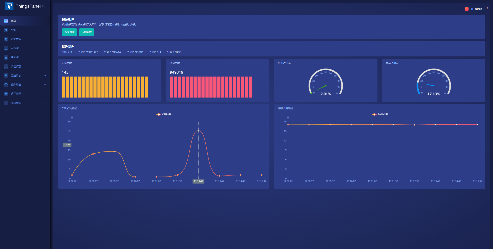

# ThingsPanel

[![哔哩哔哩](https://img.shields.io/badge/dynamic/json?url=https%3A%2F%2Fapi.swo.moe%2Fstats%2Fbilibili%2F572376973&query=count&color=282c34&label=%E5%93%94%E5%93%A9%E5%93%94%E5%93%A9&labelColor=FE7398&logo=data%3Aimage%2Fpng%3Bbase64%2CiVBORw0KGgoAAAANSUhEUgAAAGAAAABgCAYAAADimHc4AAAD7ElEQVR4nO2dW9WrMBCFK6ESkFAJSKiESqgEHCABCZWAhEpAAhL2ecik5dDc%2FpXLBDLfWnlqy0xmJ5BMQnq5CIIgCIIgCIIgCIIgCEIBAHQAemYfrgCunD6wAKAHsEKxALgx+bCQD8%2FS9tmgVqeDr1lLigDgZvDhXso+K9TyTBQRwRJ8AHjntl0Flh5QRAQK%2FmKxPeayWx2OXpBNBKiHvi34b7T2MC4pAvW6twR%2FRwkRKPizBN8CgEcuESj4Lwm+BwBjahEk+H8EwJRKhOaCDzW8e1JLfkUUH1NgmR3XmHffHR1l+72BSs8d7w8U+JDAnZERQMcV+CtUi7dNqFqibB4J7vtrq7xKCuAasbTMXCL4T+5aVk6+2xHUrWdhruAR6HIJcOeu2UHI8zyAe2ytWfEdWz9PVvQ8YAmIQ5dDAB9LFsMVAv8oMO2zAGrC5WNIarRiAuKR9jYEd9pY08aa6uUzIHGRdkgKd8pY0yc1WjEBAqypDYoAG0QAZkQAZkQAZkQAZk4vANQenjsSzS3I%2FwcSbXU5jQBUkRtdf4Rar90v8kSv3+I3ffCCSpk8I%2Fw+lgDkdI%2Fv2rEp2CaiWm1AsDQLlDAD+dlFXLMeAaCSeLZdaSFE5VUQNot38cKuEeBgAsSuG0flVZBmEanbXfNQAsS0fgBYIn2fIu3%2FBBMHEyBmDXlFfA8IzeHb+Ems4WAChKykrVA9ZfsQTL57jXzRg4A5wC%2FA8N4ADiZAZwm2XjW75Qh2KOTfA0p4kygPw28OJcCVgn3nDnYo2EwEYRgGH0qAMyICMCMCMCMCMCMCMCMCMCMCfP3qwHDOQ4AAUekTk8FaBRihJnZdYbvtCGC7LvmkM63GjVDINPFrQgCq5ETXfmMzI90FXzPvfqt7x4rEu%2FZaEcCUxFvgz2zO+BUn6UkoaEEAsptiMSX5e8FoRYCN7cVgb4Vq7U%2FH50Pq4JNP7Qiw8UFnJwcK+tXy+Wj6PLEvPgHSHv5UgwA1IQIwwyFAyLJin9RoxYgAzAQIkPwNmf26busC+OIx5TDqo5nDT+F%2FSS%2F9CYzwb+No49zNy2evkYv0LywGGAXUvp6eSneycqOic0w20k7CNgKE7jJunSGLACTCxF27ylmQc98T5MQUH49swd+I0HPXslLKnT0N+wnkrTKi9JZL%2FL9i1SorMmdeQ4TQQ7OFMxIMzGD45w8nUL1im7efENZLJpgPSw0pfz0cdt4U3230Td%2FTvx2R6d2FrHhEWLkq5PELOMsRPHCPnAZGv1xJteL7jbJiaW3sB2nDvPC%2FosSYvjRQz4cJ6n7KO3rYQL7M+L6nVtfDVRAEQRAEQRAEQRAEIZ5%2FSAXmdfXaoQsAAAAASUVORK5CYII%3D&suffix=+%E5%85%B3%E6%B3%A8&cacheSeconds=3600)](https://space.bilibili.com/572376973)
[](https://github.com/ThingsPanel)
[](https://www.zhihu.com/people/thingspanel) 



***ThingsPanel***是一个通用、开源的物联网应用平台，旨在通过可复用的组件，减少开发工作，加速物联网项目交付。

***插件化***是ThingsPanel最大的特点，通过插件，使物联网的复杂性大大降低。进一步降低成本、提高效率。同时也降低运维的难度与成本。

ThingsPanel的插件主要有3类，分别是：
- 设备插件
- 协议插件
- 可视化插件

通过以上五种的***复用***，可以大大提高研发效率，比以前的方式，成倍的提高效率，降低成本。

## 产品用途

- 设备上云与企业物联网+。

## 优势

- 模块化构建，实现业务更快。
- 简单易用。
- 易拓展

## 演示

http://dev.thingspanel.cn

账户:`admin@thingspanel.cn`密码:`123456`

## 针对用户与场景

- 快速交付项目
- 快速开发自己的方案
- 设备物联网+

## 解决问题

- 针对物联网项目开发慢、复杂度高的问题。
  
## 系统架构


## 技术栈
- Golang：天生优异的并发性能，节省硬件成本，可适用于边缘设备。
- Vue.js：前端构建，体验更佳
- PostgreSQL：更高的负载能力，更低的拥有成本。
- TimescaleDB ：时序数据库，PostgreSQL插件。
- Nginx：高性能Web服务器。
- GMQTT：高性能消息队列处理。
- Redis：NoSQL缓存数据库
  
## 快速安装系统

### 先决条件
* 需要先安装好Docker、Docker Compose、Git
* 使用MQTT模拟器，可使用MQTTbox、 MQTT.fx ，或者使用设备推送数据。

### 通过Docker容器安装ThingsPanel

通过容器化部署是搭建ThingsPanel的最快方式。

1. 获取docker-compose源码
   
    ```bash
    git clone https://github.com/ThingsPanel/thingsPanel-go-docker.git
    ```
1. 进入目录并启动服务

    ```bash
    cd thingsPanel-go-docker
    docker-compose -f docker-compose.yml up
    ```
1. 登录
    ```text
    输入网址:服务器ip:8080
    输入账户:super@super.cn
    输入密码:123456
    ```
### 接入一个温湿度设备并查看数据


1. 创建业务、创建设备
   
    ```text
    1. 创建业务
    2. 创建设备
    3. 绑定插件
    4. 编辑参数
    ```
1. 推送数据（可使用MQTT工具推送模拟数据）
   
    ```text
    1. mqtt用户名为AccessToken
    ```
1. 查看数据和可视化
 
    ```text
    1. 点击数据管理查看数据
    2. 点击可视化通过图表展示数据
    ```

## 项目文档
http://thingspanel.io

## 参与讨论和贡献
```
qq群①：260150504（已满）
qq群②：371794256
```

欢迎有兴趣者加入沟通和讨论

参与贡献请联系群主


