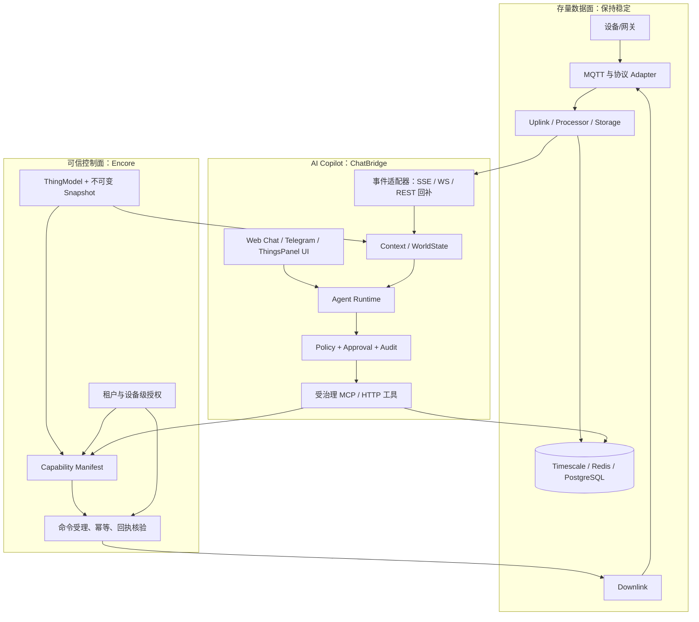

# ThingsPanel AI 原生物联网升级方案

> 决策日期：2026-09-16  
> 目标：以最小重构成本，在不破坏现有设备接入与租户业务的前提下，交付可售卖、可信、可演进的 AI Copilot 能力。

## 0. 一句话结论

**继续建设 Encore 设备元数据服务；将 ChatBridge 作为 AI Copilot 的编排与交互层；LangGraph 只作为 ChatBridge 内部的可替换工作流运行时；通过受治理的 MCP/HTTP 能力接口开放平台。**

不要把现有 Go 后端整体重写到 Encore，不要把 LangGraph 当作物联网平台内核，也不要让模型直连数据库、MQTT 或现有 CRUD API。

这不是三选一：

| 层 | 推荐技术与职责 | 不应承担的职责 |
|---|---|---|
| 设备事实与控制面 | **Encore Device Metadata**：物模型、版本快照、设备/模板/接入关系、能力查询、命令受理 | 对话、提示词、长任务推理 |
| 存量设备数据面 | 现有 ThingsPanel：MQTT、Uplink/Downlink、Timescale、Redis、告警、场景 | AI 决策、跨系统记忆 |
| AI 编排与交互 | **ChatBridge**：多租户会话、事件入口、WorldState、工具调度、审批、人机协同、审计 | 设备元数据事实源、协议适配 |
| Agent 工作流内核 | **LangGraph（仅内部使用）**：持久状态、工具循环、人工中断/恢复 | 租户治理、工具权限、领域数据模型 |
| 对外 Agent 标准接口 | MCP + 版本化 HTTP/OpenAPI：最小能力面、OAuth/租户授权、审计 | 绕过策略直接控制设备 |

## 1. “AI 原生物联网”在 ThingsPanel 中到底意味着什么

它不是“在页面加一个聊天框”，也不是“把历史遥测全部放进向量库”。对 ThingsPanel，AI 原生必须同时满足五件事：

1. **语义可读**：每个设备、字段、单位、枚举、告警、命令及参数都有机器可验证的定义。
2. **事实可取**：AI 读取的是有租户边界、时效、来源和置信度的上下文，而不是猜测或拼接 SQL。
3. **动作可控**：AI 只能调用声明过的能力；写操作经过参数校验、策略、审批、幂等和回执核验。
4. **过程可追**：一次回答或控制能追到模型、输入证据、工具调用、操作者、策略判定和设备实际结果。
5. **效果可学习**：用离线评测和运行反馈持续改善诊断、规则生成与物模型生成，而不是让模型在线“自我修改”。

模型能力会继续快速变化；真正不会被替代的护城河是客户现场的设备语义、连接器、历史运行证据、权限规则和可验证的处置闭环。

## 2. 现状与根因

### 2.1 可复用资产比想象中多

现有社区版已经具备分层的数据面：`Adapter → Uplink → Processor → Storage`，下行也有 `API/场景 → Downlink → Adapter → 设备`。这意味着 MQTT、协议脚本、时序写入和实时状态不需要为了 AI 重写。

相关设计见：[设备数据接入层架构设计总结](demand-community/importance-2025.10.15-设备数据接入层架构设计总结.md)。

已有的 Encore 元数据服务已经把正确的控制面概念落到了独立服务：Thing Model、设备模板/实例、不可变版本快照、标准 `PROPERTY/EVENT/COMMAND` 项、命令与当前遥测查询，并且 ChatBridge 适配器已可 Encore-first 地调用这些能力。

ChatBridge 也已经具备多租户对话、WorldState、LangGraph 工具循环、动作入口、会话持久化和审批/审计基础。现有工具面已把 `device.command` 作为唯一设备控制入口，这是非常好的边界。

### 2.2 真正的短板是“语义和治理”，不是模型能力

当前社区版物模型以四张类型表（遥测、属性、事件、命令）存在；同一标识符只在单表内唯一，版本字段没有真正的快照、diff、发布、回滚与影响分析。API 还以 URI 字符串判断模型类型。这样做能支撑表单配置，却不能作为 AI 的稳定能力契约。

如果直接让 AI 调现有 API，会出现四类高风险：

- 同一个 `temperature` 在属性和遥测中语义冲突；
- 物模型修改后，AI 不知道设备实际绑定的是哪个版本；
- AI 可以“调用成功”但无法证明设备真正执行；
- 多租户、设备级 `view/control/manage` 权限会在查询、控制、日志之间穿透。

因此第一优先级不是换一个更会推理的模型，而是把**设备语义变成版本化、可授权、可执行、可验证的契约**。

## 3. 目标架构

### 必须冻结的五个契约

| 契约 | 最小内容 | 为什么先做 |
|---|---|---|
| `ThingModelSnapshot` | `snapshot_id`、版本、项定义、单位/枚举/量程、命令 schema、发布状态 | AI 与设备实例都引用同一个不可变语义 |
| `CapabilityManifest` | 每台设备可读字段、可控命令、参数 JSON Schema、风险等级、所需权限 | 防止 AI 根据名称臆测命令 |
| `ContextPacket` | 设备身份、快照版本、最新值、趋势/异常、告警、数据新鲜度、来源 | 控制 token 成本，避免把原始历史直接塞给模型 |
| `ActionReceipt` | `request_id`、幂等键、策略/审批、下发结果、设备回执/读回、最终状态 | “发出命令”与“设备已执行”必须区分 |
| `PolicyDecision` | 主体、租户、设备范围、动作级别、allow/deny/approval、原因 | 让权限和审批不依赖提示词 |

## 4. 关键技术决策

### 4.0 Go 框架不是信仰：在本项目中的对比、边界与取舍

以下不是“全网框架排行榜”，而是按 ThingsPanel 当前问题筛选出的代表性选项：现有 HTTP 框架（Gin）、极简标准库路线（`net/http` + Chi）、两类传统微服务框架（Kratos、go-zero）、可组合工具包（Go kit）和应用/基础设施一体化框架（Encore）。Fiber、Hertz 等以 HTTP 吞吐或特定网络模型为主要卖点的框架没有列为主选项：现有系统的首要瓶颈是元数据契约、版本、权限和回执，不是路由器性能。

评估维度是：首个 AI Copilot 闭环速度、对现有 Gin 数据面的迁移代价、设备控制面所需的契约/资源/可观测能力、运维自主性，以及团队长期维护成本。下表的“适配分”是**面向当前项目的决策评分，不是通用性能排名**；权重依次为 30% 首期速度、25% 迁移代价、20% 控制面工程能力、15% 运维自主性、10% 可维护性。

| 选项 | 一手资料能确认的核心能力 | 采用的收益 | 不采用/代价 | 当前适配分（5 高） | 本项目结论 |
|---|---|---|---|---:|---|
| **Encore.go** | 以 Go 声明 API、服务、数据库、Pub/Sub、缓存等资源；生成 API 文档/客户端；本地到生产的基础设施、日志和 tracing 一体化；可部署到自有云账户 | 新控制面可把“契约、资源、可观测”一次建好，减少手工脚手架和跨服务配置；现有 `devicemetadata` 已在运行，复用成本最低 | 有 Encore 应用模型和工具链约束；需学习资源声明、迁移和运行方式；不适合为了统一而硬迁高吞吐存量链路 | **4.1** | **首选，仅用于新增/迁移的设备控制面** |
| **继续 Gin（现有）** | 高性能 HTTP 路由、路由组、绑定校验和中间件生态；社区版已依赖 Gin | 不需要迁移，团队熟悉，最适合稳定维护 MQTT/API 数据面 | 数据库迁移、服务边界、API 客户端、Pub/Sub、拓扑、分布式追踪与部署规范需团队逐项建设和守住；“直接加 LLM”最快但会留下治理债 | **3.6** | **保留，不再作为新 AI 控制面的唯一底座** |
| `net/http` + **Chi** | 纯 `net/http` 兼容、轻量可组合、无外部依赖、可生成路由文档 | 技术锁定最低，适合极小、长期稳定的边缘/适配器服务 | 要从 Gin 迁移；AI 控制面仍需自行拼装迁移、契约、可观测、资源治理，P0 反而变慢 | **2.9** | 仅在独立轻量 adapter 有明确必要性时选用 |
| **Kratos** | 传统 Go 微服务框架，提供 HTTP/gRPC transport、中间件、注册发现、日志、指标；官方资料包含 OpenTelemetry tracing 实践 | 若未来确定有大量 Go 领域服务和 gRPC 治理需求，架构一致性较好 | 对既有 Gin/Encore 双栈再引入第三栈；服务模板、注册发现、配置与发布体系仍要自建/运营，P0 学习和迁移成本高 | **3.1** | 不作为当前 P0 选择；在“多 Go 微服务”成为明确事实后复评 |
| **go-zero** | REST/RPC、`.api`/proto 驱动的 `goctl` 代码生成、限流/熔断/过载保护、服务发现、追踪与指标 | 从零开始建大量标准 REST/RPC 服务时，样板代码和韧性能力较完整 | DSL/生成代码会引入另一套工作流；从现有 Gin 与 Encore 迁移收益不足，设备语义和审批仍需自行设计 | **3.3** | 不作为当前 P0 选择；适用于日后独立的新 Go 服务群，而非补救存量 |
| **Go kit** | 面向微服务/优雅单体的可组合工具包，补足 RPC、观测和基础设施集成，但“少主张” | 最大设计自由度，可精细匹配复杂领域边界 | 自由也意味着大量架构和样板由团队承担；对“最短时间做出可卖 Copilot”最不利 | **2.7** | 不选；除非团队明确要维护自己的平台基座 |

资料依据：[Encore.go](https://encore.dev/docs/go)、[Gin](https://gin-gonic.com/en/docs)、[Chi](https://github.com/go-chi/docs)、[Kratos](https://go-kratos.dev/blog)、[go-zero](https://github.com/zeromicro/go-zero)、[Go kit](https://gokit.io)。

#### 为什么此处应采用 Encore，而不是“继续 Gin”或“另换一个 Go 框架”

本项目的最小竞争力不是新增一个 HTTP endpoint，而是让一台设备的语义、授权、命令参数、执行回执和审计在多个服务之间保持一致。Encore 能以最小新增栈承接这块新控制面，因为同类服务已经存在；Gin 则继续守住成熟数据面。这个分工让 P0 不需要同时解决“重写后端”“选微服务平台”“接入 AI”三件高风险工作。

| 决策 | 得到什么 | 放弃什么 | 防止失控的条件 |
|---|---|---|---|
| **采用 Encore 作为控制面** | 类型化 API、资源/服务图、统一本地开发和 tracing；版本化元数据服务可独立演进 | 部分框架自由度，团队需遵循 Encore 项目模型 | 只迁移 `ThingModel/Device/Capability/Command`；保持 OpenAPI/事件契约可被非 Encore 客户端调用；每个迁移有回退和 compatibility adapter |
| **不采用 Encore，继续 Gin** | 零框架迁移、最强部署自由度 | 必须自行补齐 schema、客户端、迁移、观测、服务边界与发布纪律；短期看快，长期治理成本更高 | 只有当 Encore 无法满足自有部署/合规要求，或 P0 试点证明其工具链阻塞交付时才切换 |
| **改用 Kratos/go-zero** | 传统 Go 微服务的代码生成、RPC/韧性能力或治理模式 | 新增第三技术栈，仍不能自动解决设备语义和 Agent 安全 | 仅在后续路线已确认“多个新 Go 业务服务 + gRPC/注册发现”且有团队/运维容量时采用 |
| **改用 Chi/Go kit** | 极低依赖或最高可组合性 | 自建工程平台，首期业务价值最慢出现 | 仅给极小 adapter 或有明确自研平台战略时使用 |

> 反证与风险也必须写清：项目历史审查已发现 Encore 的数据库命名/迁移、Legacy JWT 会话语义和租户校验存在过待收口项。因此“采用 Encore”不等于“可直接替换社区版”；它恰恰支持本方案的渐进控制面策略，而非全量重写。

#### 三年存活风险：不预测“谁永远不死”，用可复核信号做选择

没有任何第三方框架能被承诺“三年后还活着”。正确问题是：即使维护者退出，业务能否继续运行、修安全漏洞、跟上 Go 升级，并以多小代价迁出。以下判断截至 2026-09-16，依据公开维护/发布信号和架构耦合度；**A 不是保证，C 也不是宣布项目死亡**。

| 候选 | 当前可复核的存活信号 | 严重缺陷或三年风险 | 三年姿态 | 对 ThingsPanel 的用法 |
|---|---|---|---|---|
| `net/http` / 标准库 | Go 官方维护、生态兼容面最大 | 不提供应用分层、校验、OpenAPI、迁移、依赖注入、追踪或微服务治理；这些都要自建 | **A：最强退出能力** | 作为所有 HTTP 服务的兼容底座；小 adapter 可以直接使用 |
| Gin | 官方文档和维护团队持续维护；基于 `net/http`，已有社区版运行经验 | 它只是 Web 框架，不会自动提供领域契约或分布式治理；中间件拼装失控会回到“大单体” | **A-：低锁定、低迁出成本** | 继续守住社区版数据面；不要把它误认为 AI 控制面方案 |
| Chi | 持续发布 v5.x，原生 `net/http`、无外部依赖、可组合 | 极简意味着鉴权、规范、生成、观测和治理须自行统一；维护活跃度不能替代团队架构纪律 | **A-：低锁定** | 新的极小 HTTP adapter 可选；不值得为此迁移 Gin |
| Echo | 官方仓库明确 v5 为当前线，v4 有到 2026-12-31 的安全/bug 支持政策，基于 `net/http` | v4→v5 已发生大版本升级；切换成本对现有 Gin 系统没有收益 | **A-：健康，但切换无商业价值** | 不引入；仅在外部团队已有 Echo 标准时兼容 |
| Kratos | 官方仓库 2026-06 发布 v3.0.0，已有大量 release；HTTP/gRPC 与 OpenTelemetry 实践齐全 | 大版本演进、注册发现/配置/基础设施运维复杂；国内生态/人才与既有 Gin/Encore 双栈会增加组织成本 | **B+：可持续，适合明确微服务组织** | P0 不引入；未来大量 Go + gRPC 领域服务时重新评估 |
| go-zero | 公开 v1.9.3 发布、文档和 `goctl` 工具持续更新；工程韧性能力完整 | `.api`/`goctl` 工作流和生成代码形成工具链绑定；其收益只在大量标准 RPC/REST 服务时体现，不能替代元数据/权限设计 | **B+：可持续，适合统一服务工厂** | P0 不引入；未来新服务群而非存量修补时评估 |
| Fiber | 仍有活跃 v3 路线，并提供 `net/http` adapter | 核心运行于 `fasthttp`；官方材料也承认接入 `net/http` 中间件/库需要转换并付出开销。`fasthttp` 自身说明其 API 演进更快、HTTP corner case 和流式能力与标准库有差异 | **B：框架可活，但兼容/安全回归成本较高** | 不用于控制面；只有压测已证明边缘吞吐瓶颈且能承担专门回归时采用 |
| Encore | Encore.go SDK、开源工具与自有云部署路径仍可用；现有 `devicemetadata` 已验证可跑 | 应用模型、CLI、基础设施工作流与供应商生态形成更高耦合；项目内已出现迁移/鉴权/租户收口项，不能假设无成本替换 | **B：可用，但必须保留退出权** | 仅控制面；用 OpenAPI、事件契约、普通 PostgreSQL/MQTT 和 compatibility adapter 保留迁出路径 |
| Go kit | 稳定的、低主张的微服务工具包，仍可在现有 Go 项目使用 | 本轮公开检索未获得足够新的发行节奏证据；其“少主张”让团队承担更多架构与样板，易出现事实上的内部框架 | **C：不作为新的战略基础** | 不新增；已有依赖可维护，新增能力优先标准库/明确框架 |
| Gorilla/mux（历史反例） | 曾被广泛采用，仓库后来仍有维护活动 | 该项目曾被归档，引发 Go 社区迁往标准 `ServeMux` 或替代路由器的讨论；即使后来恢复活动，也说明单一维护治理中断会迫使下游仓促迁移 | **反例，不以“已复活”作为新押注理由** | 新代码不选；已有代码按普通 `net/http` 接口逐步去耦 |

资料依据：[Gin 维护资料](https://gin-gonic.com/en/docs/learning-resources)、[Chi v5 release](https://github.com/go-chi/chi/releases)、[Echo 支持策略](https://github.com/labstack/echo)、[Kratos v3 release](https://github.com/go-kratos/kratos)、[go-zero release](https://github.com/zeromicro/go-zero/releases)、[Fiber 的 `net/http` 适配说明](https://docs.gofiber.io/blog/fiber-v3-express-style-handlers)、[`fasthttp` 与标准库差异](https://github.com/valyala/fasthttp)、[Gorilla/mux 归档曾引发的迁移讨论](https://github.com/golang/go/discussions/60227)。

框架真正“死掉”通常不是性能变差，而是下列原因：

1. **维护治理中断**：核心维护者退出、漏洞和新 Go 版本不再响应；Gorilla/mux 的归档事件就是必须预演的风险。
2. **与标准生态偏离过深**：专属 handler、DSL、运行时或云服务让中间件、测试工具和人才无法复用；Fiber/`fasthttp`、生成式 DSL 都属于这一类风险。
3. **承诺过大但组织能力不足**：框架把服务发现、配置、RPC、韧性全部带进来，而团队没有平台运维能力，最后不是框架死，而是项目被框架复杂度拖死。
4. **业务与框架绑定**：把 ThingModel、权限、命令语义写进框架注解、生成文件或专属数据库后，替换框架等于重写业务。

因此无论最终选哪一个，都必须执行四条“活三年保险”：

- 业务接口以 OpenAPI/AsyncAPI、JSON Schema 和事件 envelope 为准，而不以框架类型为准。
- 数据只使用可直接访问的 PostgreSQL、Redis、MQTT/Kafka 等标准基础设施；迁移脚本由仓库维护并可独立运行。
- agent 工具调用只依赖版本化 HTTP/MCP 契约，不依赖 Gin/Encore/Kratos 的内部对象。
- 每 6 个月做一次框架健康检查：最近安全修复、Go 版本兼容、关键依赖 CVE、至少两名可维护者、从新服务到替代框架的迁移演练。

### 4.1 Encore：保留并加速，但只迁移控制面

**决定：Yes。** 把 Encore 作为新设备元数据与能力服务的宿主，不迁移当前高吞吐的 MQTT/Uplink/Storage 热路径。

理由：Encore 的 Go/TypeScript SDK 直接表达 API、数据库、Pub/Sub、缓存与可观测性，并支持部署到自有云账户；它适合契约优先、独立迭代的控制面，而不是要求把成熟的存量数据面一次性拆微服务。[Encore 官方文档](https://encore.dev/docs/ts/develop/api-calls)

落地原则：

- Encore 成为新建/迁移设备的**语义事实源**；社区版保留为兼容投影和数据面。
- 一台设备绑定一个 `ThingModelSnapshot`；已绑定设备不被草稿修改隐式影响。
- 通过 outbox/事件把发布的快照和设备能力投影给存量平台与 ChatBridge；禁止跨库双写。
- 迁移按模板/租户灰度，保持 legacy fallback 可观测，直到每个读取/控制路径有足够证据再下线。

### 4.2 ChatBridge：采用为 AI 产品层，不把领域逻辑塞进去

**决定：Yes，复用现有 ChatBridge。** 它已具有事件治理、会话、WorldState、工具路由和人机协同；把 ThingsPanel 专属内容放在 `thingspanel-event-adapter`、Encore capability adapter 和 policy 配置中。

ChatBridge 的职责是“基于事实与策略编排”，不是保存物模型真相。新增任何 IoT 能力都必须走版本化工具 manifest，不能让 prompt 直接决定 API 路径或 SQL。

### 4.3 LangGraph：使用，但不单独立项成为平台架构

**决定：Conditional Yes。** LangGraph 很适合需要持久执行、人工中断/恢复和确定步骤与 LLM 步骤混合的诊断/处置流程；这正是告警排障、建议生成、审批后执行的需要。[LangGraph 官方概览](https://docs.langchain.com/oss/python/langgraph/overview)

但 LangGraph 是低层编排运行时，不是租户、权限、物模型、工具市场或设备控制平台。保持它位于 ChatBridge 的 `AgentRuntimeKernel` 后面：可以升级、替换或为简单路径绕过，而不会污染领域模型。

### 4.4 MCP：作为互操作出口，不能作为安全边界本身

**决定：Yes，分阶段。** 先把已有的受治理 HTTP capability API 封装成内部 MCP server；首批仅开放只读工具与单设备受审批控制工具。MCP 的 HTTP 授权可基于 OAuth 2.1 相关标准，但协议授权不代替业务权限、设备范围校验和动作审计。[MCP Authorization 规范](https://modelcontextprotocol.io/specification/2025-06-18/basic/authorization)

禁止提供“任意 SQL”“任意 HTTP”“通配符 MQTT publish”工具。

## 5. 最小可售 MVP：先做一个让客户立即感知价值的闭环

### 只承诺三个场景

1. **问设备**：用户问“冷库 3 号现在什么情况、今天是否异常？”AI 回答最新值、趋势、数据时间、关联告警及证据链接。
2. **告警诊断**：温度异常触发后，AI 自动汇总设备状态、同类设备、近 24 小时趋势、历史相似事件，给出可执行但不自动控制的建议。
3. **受审批控制**：用户说“把 3 号冷库调到 4℃”；AI 先展示设备、命令、参数、影响和风险，审批后才执行，并返回实际回执/读回结果。

这三个场景覆盖“看得懂、查得准、控得住”，比一开始做泛化自主 Agent 更容易卖、更安全，也更容易验证。

### 30/60/90 日路线

| 阶段 | 交付物 | 明确不做 | 完成门槛 |
|---|---|---|---|
| 0–30 天：可信底座 + Demo | Snapshot/发布/回滚；`device.context`、`telemetry.history`、`device.command` 三个工具；ContextPacket；只读问答与人工审批控制 | 全量物模型迁移、自动执行、向量库大工程 | 选定一个真实设备类型，三个场景端到端录屏且有审计 |
| 31–60 天：可用 Copilot | SSE/WS/REST 事件适配与回补；异常诊断卡片；ActionReceipt；租户/设备级授权；指标看板 | 多 Agent、跨租户知识共享、自动改配置 | 2 个租户隔离测试通过；命令 100% 有幂等键和最终状态 |
| 61–90 天：差异化生产力 | AI 辅助生成物模型草稿与映射；影响分析；规则/告警建议的“生成—仿真—审批—发布”；离线评测集 | 让 AI 直接发布/删除资源 | 新模板接入时间下降 50% 以上，诊断建议有可量化采纳率 |

## 6. 实施顺序与仓库边界

| 优先级 | 工作 | 建议归属 | 结果 |
|---|---|---|---|
| P0 | 冻结上述五个 JSON/OpenAPI 契约；定义错误码、幂等和审计字段 | `iot-api-encore-kernel` | 所有团队能并行，避免接口返工 |
| P0 | 完成 ThingModel Snapshot 发布、绑定、回滚与 `command-identifiers` | Encore `devicemetadata` | 设备能力可被安全发现 |
| P0 | 在适配器中实现三个只读工具和一个控制工具；保留 `backend_mode/degraded` | `chatbridge-thingspanel-adapter` | Agent 不绕过元数据服务 |
| P1 | 用 SSE/WS/REST 回补产出标准事件 envelope | `thingspanel-event-adapter` | 不侵入社区版主仓 |
| P1 | 动作等级、审批、ActionReceipt、策略回放 | guardrails + ChatBridge | 可控地从建议走向执行 |
| P2 | 在社区版仅补必要事件字段、观测和兼容投影 | `thingspanel-backend-community` | 降低存量风险 |

**社区版本仓不应承载 AI agent 代码。** 它只需要稳定地产生有类型的事件、维持设备接入和执行现有协议。这样社区版仍可独立使用，Copilot 发行版也能独立升级。

## 7. 安全、可靠性与成本红线

- 默认 `readonly`；`notify` 可自动；`config_change` 和 `device_control` 需审批；批量/删除/跨租户必须双人审批。
- 每次工具调用带 `tenant_id`、actor、授权设备集合、`request_id` 和 `idempotency_key`；服务端而不是 Agent 做校验。
- `ActionReceipt` 分开记录：受理、下发、协议 ACK、设备回执、读回核验、超时/失败。没有读回时不得宣称“已执行”。
- ContextPacket 只带任务所需的摘要和引用；大历史通过分页工具按需取数。原始 payload、凭据和无权限设备不得进入 prompt。
- 在模型与提示词之外建立评测集：设备定位、数据解释、参数校验、越权拒绝、审批绕过、回执误报六类用例必须回归。
- 以每租户 token/工具调用/成功执行/人工接管率计量成本和质量；成本超阈值时降级为确定性诊断卡片，而非静默失败。

## 8. 验收指标：不以“聊天能回答”为验收

| 维度 | MVP 门槛 | 90 天目标 |
|---|---:|---:|
| 设备定位正确率 | ≥95%（固定验收集） | ≥98% |
| 只读结论可引用证据比例 | 100% | 100% |
| 写操作策略/审批/审计覆盖 | 100% | 100% |
| 声称执行成功但无回执/读回 | 0 | 0 |
| 跨租户或越权工具调用 | 0 | 0 |
| 新设备模板到可问答/可控的配置时长 | 建立基线 | 下降 ≥50% |
| 告警到“首个可用处置建议”时间 | 建立基线 | 下降 ≥60% |

## 9. 方案对比与推荐

| 方案 | 速度 | 风险 | 长期竞争力 | 结论 |
|---|---|---|---|---|
| A. 在社区版直接接 LLM + CRUD | 最快演示 | 极高：语义、权限、回执都不可靠 | 低，易被复制 | 不采用 |
| B. 先全量微服务化/全量 Encore 迁移，再做 AI | 最慢 | 高：存量业务与接入风险 | 中 | 不采用 |
| C. 只做 ChatBridge/LangGraph 聊天 Agent | 快 | 中高：数据事实源仍薄弱 | 中，易沦为聊天壳 | 不单独采用 |
| **D. Encore 控制面 + ChatBridge 编排 + 渐进式 MCP（推荐）** | **快** | **可控** | **高：语义、连接器、治理形成壁垒** | **立即执行** |

推荐 D 的必要性可以用一个场景说明：客户问“为什么 3 号冷库温度高，能不能调低？”

- 以前：人工在设备页、曲线页、告警页间跳转，再去找控制入口；物模型变更可能让控制参数含义漂移。
- 改后：Copilot 从绑定快照读取 `temperature` 的单位/量程和 `setpoint` 的参数 schema，引用近期趋势与告警，先给证据化判断；控制前展示影响并走审批；执行后只以设备回执或读回确认结果。

这同时缩短了运维时间、减少误操作，并把 ThingsPanel 从“设备 CRUD 工具”提升为客户日常工作台。

## 10. 立即开始的建议

建议批准一个 **4 周、一个设备类型、三个场景** 的 P0，而不是再做一轮大架构讨论。第一周冻结契约和验收集；第二周打通 Encore 能力与 ContextPacket；第三周接入 ChatBridge 的问答/审批；第四周做真实设备演示、失败演练和指标基线。

启动条件只有三个：

1. 指定首个高价值、风险可控的设备类型（建议冷链/HVAC 中有明确读数和单一设定值的一类）。
2. 明确一位业务验收人和 30–50 条真实问答/告警/控制样本。
3. 确认 P0 所有控制动作均为“人工审批后执行”，不开放自动控制。

## 11. 本次分析的依据与验证范围

本方案已交叉阅读现有社区版的系统架构、物模型问题清单、数据接入重构设计，以及相邻 Encore 元数据服务和 ChatBridge 的当前设计/工具清单；未修改任何运行时代码。结论以源码和设计证据为基础，但尚未在生产设备上做运行验证。

外部技术判断参考：

- [Encore 官方文档](https://encore.dev/docs/ts/develop/api-calls)
- [Encore.go 框架与资源声明](https://encore.dev/docs/go)
- [Gin 官方文档](https://gin-gonic.com/en/docs)
- [Chi 官方文档](https://github.com/go-chi/docs)
- [Kratos 的 OpenTelemetry tracing 实践](https://go-kratos.dev/blog)
- [go-zero 官方仓库与能力说明](https://github.com/zeromicro/go-zero)
- [Go kit 官方说明](https://gokit.io)
- [LangGraph 官方概览](https://docs.langchain.com/oss/python/langgraph/overview)
- [MCP HTTP Authorization 规范](https://modelcontextprotocol.io/specification/2025-06-18/basic/authorization)
- [OpenAI GPT-6 Astra 模型指南](https://developers.openai.com/api/docs/guides/latest-model)：Astra 的多步骤工作流能力提升了 Agent 上限，但不改变本方案中“领域契约和服务端治理优先”的原则。
