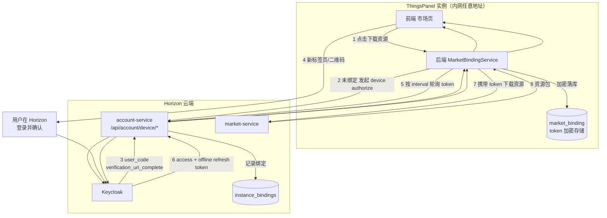

# ThingsPanel 应用市场资源下载认证设计 v1（Device Flow 实例绑定）

| 项目 | 内容 |
|---|---|
| 文档状态 | 分阶段实施：第一阶段已开发，Device Flow 待后续排期 |
| 日期 | 2026-07-28 |
| 涉及仓库 | `thingspanel-horizon`、`thingspanel-backend-community`、`thingspanel-frontend-community` |
| 方案 | 本地账号独立 + OAuth 2.0 Device Authorization Grant（RFC 8628）实例级绑定 |
| 前置事实 | Horizon 已运行 Keycloak + Kong，Device Flow 为 Keycloak 原生能力 |

---

## 0. 分阶段实施决策

为降低首轮改造范围，注册解耦与市场认证升级拆分实施。

### 第一阶段（本轮）

- 首次安装直接展示 ThingsPanel 本地超管注册页，填写用户名（邮箱）、密码和确认密码，不跳转 Horizon
- ThingsPanel 后端不再校验超管邮箱是否已在市场注册，市场不可达也不影响本地初始化
- 超管初始化增加事务与并发保护，系统只能初始化一个 `SYS_ADMIN`
- 保留当前“首次下载时弹出市场账号密码登录框，登录后自动继续下载”的流程
- 保留旧请求中的市场回流字段和 `/tenant/market-register` 路由用于版本兼容，但不再产生市场联动

### 第二阶段（后续）

- 实施本文 Device Flow 实例绑定方案
- 移除 ThingsPanel 对 Horizon 账号密码和前端 `market_token` 的持有
- 将市场认证从浏览器会话升级为实例级长期绑定

> 第一阶段不依赖第二阶段。未实施 Device Flow 不影响本地注册、登录和现有市场资源下载能力。

---

## 1. 背景与需求

### 1.1 技术背景

ThingsPanel 是开源自建（self-hosted）IoT 平台，安装形态为：

- 用户从 **GitHub** 下载安装包，通过**脚本**安装
- 部署在**任意内网 IP / 端口**上，无固定公网域名，无法预先注册 OAuth `redirect_uri`
- 平台**日常使用完全离线可用**，不依赖任何云端服务

Horizon 是配套的云端应用市场（应用、设备模板、物模型、看板），技术栈已确认：

- **Keycloak** 作为 IdP（`account-service` 全部通过 Keycloak Admin API 操作用户）
- **Kong** 作为网关，校验 Keycloak JWT 后向后端服务注入 `X-User-Id / X-Org-Id / X-Roles`
- `market-service` 提供模板、版本、安装记录、审批、**积分（credit）**能力

两侧是两套独立的登录态，当前没有可信的身份桥接。

### 1.2 产品需求

| 编号 | 需求 | 说明 |
|---|---|---|
| R1 | **认证下载资源** | 用户安装后需要通过认证才能从市场下载应用/模板/物模型/看板 |
| R2 | **日常使用不联网** | 只有下载市场资源时才需要连云端，其余场景（含登录）必须离线可用 |
| R3 | **不接触用户密码** | ThingsPanel 实例不应经手、传输或存储用户的 Horizon 密码 |
| R4 | **最小化交互** | 用户流失敏感，绑定过程的额外交互必须压到最低 |

> **需求边界说明**：早期讨论中的「监测谁安装了系统」已由 **PostHog 链路**承担，**不属于本设计范围**。本设计只解决 R1–R4。

### 1.3 商业层面的需求

| 编号 | 商业诉求 | 对设计的约束 |
|---|---|---|
| B1 | **市场资源的可计费/可配额基础** | `market-service` 已有 credit 表（`006_create_credit_tables.sql`）。下载必须能追溯到**具体 Horizon 用户**，否则积分、配额、付费资源无从落地 |
| B2 | **开源可信度** | 开源项目会被逐行审计。任何"云端密码经手自建实例"的实现都会成为社区攻击点，损害采用率 |
| B3 | **转化率与流失控制** | 首次安装是流失最高的环节。任何一次多余的表单、跳转、等待都直接折损转化 |
| B4 | **私有化/边缘部署的可售性** | 目标客户含私有化与边缘场景。"必须常连公网才能登录"是硬性否决项 |
| B5 | **身份体系的长期演进空间** | 未来需要支持组织/团队、付费订阅、许可证、社交登录、MFA。今天的选型不能堵死这些路 |

**商业需求与技术需求的冲突点**：B3（少交互）与 B2/R3（不碰密码）直接对立。本设计的核心取舍就发生在这里，见 §2.4。

---

## 2. 方案对比

### 2.1 候选方案总表

| 方案 | 满足 R1 | 满足 R2 离线 | 满足 R3 不碰密码 | 交互成本 | 支持 MFA/社交登录 | 工程量 | 结论 |
|---|---|---|---|---|---|---|---|
| **A. 云端本地密码共用/同步** | 部分 | 是 | **否** | 最低 | 否 | 中 | **否决** |
| **B. 每次登录跳 Horizon** | 是 | **否** | 是 | 低 | 是 | 中 | **否决** |
| **C. 内嵌云端账密表单（ROPC）** | 是 | 是 | **否** | 最低 | **否** | 低 | **否决**（现状即此） |
| **D. PAT / 令牌粘贴** | 是 | 是 | 是 | **高**（跨页复制粘贴） | 是 | 高（Horizon 需自建令牌体系） | 备选 |
| **E. Authorization Code + PKCE** | 是 | 是 | 是 | 低 | 是 | **高**（需中转回调页，防开放重定向） | 备选 |
| **F. Device Flow（RFC 8628）** | 是 | 是 | **是** | 中（可优化至一次点击+一次确认） | 是 | **低**（Keycloak 原生） | **采用** |

### 2.2 逐方案否决理由

**A. 云端与本地密码共用/同步 —— 否决**

- "两边密码一致"**只在 t=0 成立**。任一侧改密码后立即漂移，且漂移不可感知
- 要维持一致必须在改密时**跨信任边界传输明文**：要么把客户的 Horizon 密码发进你不控制的自建实例，要么把实例密码回传云端。这是 OAuth 被发明出来专门消灭的 password anti-pattern
- 已有 Horizon 账号（开了 MFA、用社交登录）的用户**根本没有可同步的密码**
- 单个客户实例被拖库 → 泄露的是**你云端市场的账号密码**，爆炸半径跨越全平台。违反 B2

**B. 每次登录都跳 Horizon —— 否决**

- 直接违反 R2 与 B4：断网即锁死，私有化/边缘场景不可售

**C. 内嵌云端账号密码表单（ROPC）—— 否决（这是当前线上现状）**

- 违反 R3、B2
- `grant_type=password` 在 **OAuth 2.1 中已被移除**，新版 Keycloak 默认关闭。Keycloak 一升级即全面失效
- **结构性封死 MFA 与社交登录**，违反 B5
- 唯一优点是交互最少，但见 §2.4：这个优点在真实流程里并不成立

**D. PAT / 令牌粘贴 —— 备选，不采用**

- Docker / npm / Terraform / Grafana Enterprise / Portainer 广泛采用，安全性合格
- 但交互成本**高于** Device Flow：用户要跳转 → 登录 → 找到令牌页 → 创建 → 复制 → 切回 → 粘贴
- Keycloak **没有原生 PAT 能力**，Horizon 需自建令牌签发/存储/吊销/轮换体系，工程量最大
- 违反 B3

**E. Authorization Code + PKCE —— 备选，不采用**

- 对**有浏览器的 Web 应用**这是标准答案，交互最轻
- 但自建实例跑在任意内网 IP/端口，**`redirect_uri` 无法预先注册**。落地必须由 Horizon 托管固定中转回调页，再 `postMessage` 回实例
- 引入开放重定向与跨域来源伪造风险，需严格 origin 白名单
- 工程量与安全评审成本最高。**列为 P1 演进方向**（见 §4.2），不作为首版

### 2.3 现有方案的优缺点（线上现状）

当前实现等价于方案 C，关键代码：

| 位置 | 现状 |
|---|---|
| `thingspanel-frontend-community/src/service/api/market.ts:4` | `marketLogin(username, password)` 收集用户的 **Horizon 账号密码** |
| `thingspanel-backend-community/internal/service/market_client.go:202` | `MarketClient.Login()` 把账密代理给 Horizon |
| `thingspanel-horizon/services/account-service/internal/handler/auth_handler.go:51` | Horizon 用 `grant_type=password`（ROPC）转发 Keycloak |
| `thingspanel-frontend-community/src/views/device/config/composables/use-market-auth.ts:13` | 返回的 token 存进浏览器 **`sessionStorage`** |
| `market.ts:19,42` | `market_token` 作为**请求体参数**由浏览器逐次回传后端 |

**优点**

- 交互路径短，用户在 ThingsPanel 界面内即可完成
- 实现简单，已跑通

**缺点**

| 缺陷 | 影响 |
|---|---|
| 用户 Horizon 密码经手自建实例 | 违反 R3、B2 |
| ROPC 已废弃，Keycloak 新版默认关闭 | **定时炸弹**，升级即挂 |
| 结构性不支持 MFA / 社交登录 | 堵死 B5 |
| token 存 `sessionStorage`，无过期控制 | **关标签页即失效**，用户需反复重新登录，反而放大了 B3 的流失 |
| token 由浏览器持有并逐次回传 | 云端凭证暴露在前端，XSS 即泄露 |
| 绑定是"用户级会话"而非"实例级" | 无法支撑长期无感下载，无法吊销单个实例 |

### 2.4 关于「交互成本」的关键澄清

选型讨论中，方案 C 被认为"交互最少"。核查实际代码后，这个前提**不成立**：

- Horizon 注册**强制邮箱验证码**：前端 `portal/src/pages/auth/Register.tsx:77` 校验非空，后端 `auth_handler.go:108` 硬校验 `VerifyCode()`，不通过直接 400
- ThingsPanel 侧还需再填一次密码：`register-super-admin.vue:34`

第一阶段改造前的真实路径：

```
GitHub 下载安装 → 打开 ThingsPanel → 跳转 Horizon
  → 填邮箱密码 → 去邮箱收信抄验证码 → 提交注册
  → 跳回 ThingsPanel → 再填一次密码 → 提交
```

**"去邮箱抄验证码"的交互成本显著高于 Device Flow 的"点开链接 + 确认"。** 真正的流失点在注册流程本身，不在绑定机制。因此 B3 不构成对 Device Flow 的否决理由。

第一阶段完成后，首次安装路径调整为：

```
GitHub 下载安装 → 打开 ThingsPanel
  → 本地填写邮箱和密码 → 创建超管并登录
```

市场注册或登录仅在用户首次下载市场资源时按现有流程触发；Device Flow 上线后再替换该认证步骤。

### 2.5 为什么最终选择 Device Flow

| 理由 | 说明 |
|---|---|
| **Keycloak 原生支持** | 无需实现任何 OAuth server 逻辑，Horizon 侧仅需启用 client 配置 + 一张绑定表 |
| **天然规避 `redirect_uri` 问题** | 自建实例部署在任意地址，Device Flow 不需要回调地址。这是本部署形态下最强的技术理由 |
| **凭证不出 Horizon** | ThingsPanel 全程不接触密码，满足 R3、B2 |
| **实例级长期绑定** | 配合 `offline_access`，一次绑定长期有效，满足 R1 且不反复打扰用户 |
| **兼容 MFA / 社交登录** | 认证发生在 Horizon 页面，未来加任何认证方式都不影响，满足 B5 |
| **可吊销、可审计** | 每个实例一条绑定记录，可单独吊销 |

**已知代价（明确接受）**

1. Device Flow 的主流场景是 CLI / 无浏览器设备（`gh`、`docker`、`gcloud`）。对 Web UI 而言，Authorization Code + PKCE 才是更常规的选择。此处是**部署形态倒逼的合理取舍**，不是通用最优
2. 用户需要在 Horizon 页面完成一次确认。**通过 §3.2 的 UX 设计压缩到"点一个链接/扫码 + 点一次确认"，不需要手抄验证码**

---

## 3. 设计

### 3.1 总体数据链路



**关键原则**

1. **token 只存在于 ThingsPanel 后端**，前端永不接触，永不进入 `sessionStorage`
2. **绑定是实例级的**，不是用户会话级的。绑定一次，此后所有本地用户下载资源都无感
3. **绑定是惰性的**：只在首次下载资源时触发，日常使用与登录完全不涉及云端（满足 R2）
4. **ThingsPanel 不直连 Keycloak**，统一经由 Horizon `account-service`，以便 Horizon 记录绑定并保持 Keycloak 内网隔离

### 3.2 交互流程与 UX 标准

```
用户点「下载此模板」
  └─ 后端检测未绑定
      └─ 前端弹出绑定引导（非阻塞模态）
          ├─ 主按钮：「前往授权」→ 新标签页打开 verification_uri_complete
          │   （该 URL 已内嵌 user_code，用户无需手抄）
          ├─ 副显示：二维码（同一 URL），支持手机扫码
          └─ 兜底显示：verification_uri + user_code 文本（供复制）
      └─ 用户在 Horizon 完成登录 + 点击「确认授权」
      └─ 前端轮询后端 status，approved 后模态自动关闭
      └─ 原下载动作自动继续，无需用户重新点击
```

**UX 硬性标准**

| 标准 | 要求 |
|---|---|
| U1 | 必须使用 `verification_uri_complete`，**不得要求用户手动抄写 `user_code`** |
| U2 | 授权成功后**自动继续原下载动作**，不得让用户重新点一次下载 |
| U3 | 绑定模态不得阻塞页面其他操作 |
| U4 | 绑定成功后**永不再次弹出**，除非 token 失效或用户主动解绑 |
| U5 | 授权码过期（默认 600s）需给出明确提示与「重新生成」按钮，不得静默失败 |
| U6 | 全流程失败必须显示可诊断错误码，不得吞掉 |

### 3.3 Keycloak 配置标准

新建 client：

| 配置项 | 值 |
|---|---|
| Client ID | `thingspanel-instance` |
| Client type | Public（Device Flow 公共客户端，无 secret） |
| `oauth2.device.authorization.grant.enabled` | `true` |
| Standard flow / Direct access grants | **关闭** |
| Scopes | `openid`、`offline_access` |
| Offline Session Idle | ≥ 90 天（决定"多久不下载才需要重新绑定"） |

**Device Flow 端点（Keycloak 原生）**

```
POST {kc}/realms/thingspanel/protocol/openid-connect/auth/device
POST {kc}/realms/thingspanel/protocol/openid-connect/token
     grant_type=urn:ietf:params:oauth:grant-type:device_code
POST {kc}/realms/thingspanel/protocol/openid-connect/revoke
```

> `scope` 必须包含 `offline_access`，否则拿到的 refresh token 受 SSO Idle（默认 30 分钟）约束，用户下次下载又要重新绑定 —— 这会以更难解释的形式重现 B3 的流失问题。

### 3.4 数据模型

**Horizon 侧** `services/account-service/migrations/002_create_instance_bindings.sql`

```sql
CREATE TABLE IF NOT EXISTS instance_bindings (
    id               VARCHAR(36) PRIMARY KEY,
    instance_id      VARCHAR(64)  NOT NULL,
    user_id          VARCHAR(36)  NOT NULL,          -- Keycloak sub，稳定标识
    org_id           VARCHAR(36),
    instance_version VARCHAR(32),
    status           VARCHAR(16)  NOT NULL DEFAULT 'active',  -- active | revoked
    bound_at         TIMESTAMPTZ  DEFAULT CURRENT_TIMESTAMP,
    last_seen_at     TIMESTAMPTZ,
    revoked_at       TIMESTAMPTZ,
    UNIQUE (instance_id)
);
CREATE INDEX idx_instance_bindings_user ON instance_bindings(user_id);
```

**ThingsPanel 侧** `sql/19.sql`

```sql
CREATE TABLE IF NOT EXISTS market_binding (
    id                VARCHAR(36) PRIMARY KEY,
    instance_id       VARCHAR(64)  NOT NULL,
    market_user_id    VARCHAR(36),                   -- Keycloak sub
    market_email      VARCHAR(255),
    access_token_enc  TEXT,                          -- AES-256-GCM
    refresh_token_enc TEXT,                          -- AES-256-GCM，offline token
    access_expires_at TIMESTAMPTZ,
    scope             VARCHAR(255),
    status            VARCHAR(16) NOT NULL DEFAULT 'unbound', -- unbound|pending|active|expired|revoked
    bound_at          TIMESTAMPTZ,
    bound_by          VARCHAR(36),                   -- 本地 user id
    updated_at        TIMESTAMPTZ DEFAULT CURRENT_TIMESTAMP
);
```

**存储标准**

| 编号 | 标准 |
|---|---|
| S1 | `market_binding` **全表最多一行**（实例级单绑定），用固定主键或唯一约束保证 |
| S2 | token 必须 **AES-256-GCM 加密**后落库，密钥从环境变量 `MARKET_TOKEN_ENC_KEY` 读取，由安装脚本生成写入 `.env` |
| S3 | **禁止**将任何 token 写入日志、错误信息、API 响应 |
| S4 | `instance_id` 在实例首次启动时生成一次并持久化，重装保留则视为同一实例 |
| S5 | 任何接口**不得**返回 token 明文，`GET /market/binding` 只返回状态与脱敏邮箱 |

### 3.5 接口设计

**Horizon `account-service` 新增**（挂在 Kong 的免鉴权分组，因为调用方此时尚无身份）

| 方法 | 路径 | 说明 |
|---|---|---|
| POST | `/api/account/device/authorize` | 入参 `instance_id`、`instance_version`；代理 Keycloak device authorize；返回 `device_code / user_code / verification_uri / verification_uri_complete / expires_in / interval` |
| POST | `/api/account/device/token` | 入参 `device_code`、`instance_id`；代理 Keycloak；成功时 upsert `instance_bindings`；标准错误码 `authorization_pending / slow_down / access_denied / expired_token` |
| POST | `/api/account/device/refresh` | 入参 `refresh_token`、`instance_id`；刷新并更新 `last_seen_at` |
| POST | `/api/account/device/revoke` | 撤销并置 `instance_bindings.status = revoked` |

**ThingsPanel `backend-community` 新增**（需本地 `SYS_ADMIN` 权限）

| 方法 | 路径 | 说明 |
|---|---|---|
| POST | `/api/v1/market/binding/start` | 发起绑定，返回 `user_code / verification_uri_complete / expires_in / interval`。`device_code` 只存后端 |
| GET | `/api/v1/market/binding/status` | 返回 `pending / approved / denied / expired`，供前端轮询 |
| GET | `/api/v1/market/binding` | 返回绑定状态、脱敏邮箱、绑定时间。**不返回 token** |
| DELETE | `/api/v1/market/binding` | 解绑：调用 Horizon revoke + 清空本地记录 |

### 3.6 Token 生命周期方法

```
下载请求
  └─ TokenProvider.GetToken(ctx)
      ├─ status != active           → 返回 ErrMarketNotBound（触发前端绑定引导）
      ├─ access_token 未过期        → 直接返回
      ├─ access_token 过期          → 用 refresh_token 换新（带单飞锁，防并发重复刷新）
      │   ├─ 成功                   → 更新落库，返回
      │   └─ 失败 invalid_grant     → status = expired，返回 ErrMarketBindingExpired
      └─ 网络不可达                 → 返回 ErrMarketServiceUnavailable（明确区分于未绑定）
```

| 编号 | 标准 |
|---|---|
| T1 | access token 过期前 **60 秒**即触发刷新，不等到 401 |
| T2 | 刷新必须加**单飞锁**，并发下载不得产生多次刷新 |
| T3 | 刷新失败为 `invalid_grant` 时置 `expired` 并引导重新绑定；网络错误**不得**改变绑定状态 |
| T4 | 轮询 `device/token` 必须遵守返回的 `interval`，收到 `slow_down` 后步长翻倍 |
| T5 | 轮询总时长不超过 `expires_in`，超时置 `expired` |

---

## 4. 任务与问题

### 4.1 开发任务

> 依赖关系：H1 → H2 → B1 → B2 → B3 → F1。H 组与 B 组的表结构任务（H2/B1）可并行。

#### Horizon（`thingspanel-horizon`）

**H1 — Keycloak client 配置**
- 新建 `thingspanel-instance` public client，启用 device grant，关闭 standard flow 与 direct access grants
- 配置 `offline_access` scope，Offline Session Idle ≥ 90 天
- 验收：`curl` 直接调用 device authorize 端点能拿到 `user_code` 与 `verification_uri_complete`

**H2 — `instance_bindings` 表 + migration**
- 新增 `002_create_instance_bindings.sql`
- 验收：migration 可重复执行（幂等），`instance_id` 唯一约束生效

**H3 — `/api/account/device/*` 四个端点**
- 新建 `internal/handler/device_flow_handler.go` + `internal/service/device_flow_service.go`
- 严格透传 RFC 8628 标准错误码，不得自造
- token 换取成功时 upsert `instance_bindings`
- 验收：见 §5 用例 TC-01 ~ TC-06

**H4 — Kong 路由与限流**
- `/api/account/device/*` 走免鉴权分组
- `authorize` 按 IP 限流（建议 10 次/分钟），`token` 按 `device_code` 限流，防轮询滥用
- 验收：超限返回 429，正常轮询不受影响

**H5 — 收敛 market-service 鉴权（安全修复，见 §4.2 P-01/P-02）**
- 确认 `market-service` 端口不对外暴露，只能经 Kong 访问
- 为 `GET /api/market/templates*` 增加鉴权或明确保留为公开目录浏览（下载必须鉴权）
- 验收：绕过 Kong 直连 market-service 伪造 `X-User-Id` 无法成功

#### ThingsPanel 后端（`thingspanel-backend-community`）

**B1 — `market_binding` 表 + `instance_id` 生成**
- 新增 `sql/19.sql`
- 实例首次启动生成并持久化 `instance_id`
- 新增 `MARKET_TOKEN_ENC_KEY` 环境变量与 AES-256-GCM 加解密工具
- 验收：密钥缺失时启动**明确报错**，不得静默降级为明文存储

**B2 — `MarketBindingService` + `TokenProvider`**
- 实现 §3.6 全部生命周期逻辑，含单飞锁
- 新增 4 个 `/api/v1/market/binding/*` 接口，限 `SYS_ADMIN`
- 验收：见 §5 用例 TC-07 ~ TC-14

**B3 — 改造 `MarketClient`（本任务改动面最大）**
- `internal/service/market_client.go` 中 **13 个方法**目前全部以 `token string` 作为入参（`PublishTemplate:254`、`DownloadTemplate:419`、`InstallTemplate:520`、`DownloadBundle:557`、`DownloadBundleWithMeta:594` 等）
- 全部移除 `token` 入参，改为内部调用 `TokenProvider.GetToken(ctx)`
- 删除 `MarketClient.Login()`（`market_client.go:202`）
- `ExtractUserIDFromMarketToken()`（`:462`）改为从 `market_binding.market_user_id` 读取，不再解析前端传入的 JWT
- 验收：全仓库 `grep market_token` 在后端零命中

**B4 — 首次安装链路修复（既有缺陷，与本方案解耦但必须一并修）**
- `InitSuperAdmin`（`internal/service/sys_user.go:983` 附近）补 `Casbin.AddRolesToUser`，对齐正常建用户路径（`sys_user.go:132`）
- 初始化做成事务 + 幂等
- 验收：见 §5 用例 TC-15

#### ThingsPanel 前端（`thingspanel-frontend-community`）

**F1 — 移除前端持有云端凭证**
- 删除 `src/views/device/config/composables/use-market-auth.ts`（`sessionStorage` 存 token）
- 删除 `src/service/api/market.ts:4` 的 `marketLogin`
- 移除 `publishToMarket`、`installFromMarket` 的 `market_token` 入参（`market.ts:19,42`）
- 验收：全前端 `grep market_token` 零命中

**F2 — 绑定引导组件**
- 新建绑定模态：主按钮打开 `verification_uri_complete`、二维码、兜底文本码
- 轮询 `binding/status`，遵守 `interval`
- 严格实现 §3.2 的 U1–U6
- 验收：见 §5 用例 TC-16 ~ TC-19

**F3 — 首次安装跳转修复（既有缺陷）**
- `src/views/_builtin/login/modules/register-super-admin.vue` 校验 `auth.loginByToken` 的 `loop` 返回值
- 仅当 `/user/detail` 与 `/ui_elements/menu` 均成功才跳转；失败保留页面并显示可诊断错误
- 验收：见 §5 用例 TC-15

### 4.2 已查出的问题

跨三个仓库静态核查（2026-07-28）结果：

| 编号 | 位置 | 问题 | 严重度 | 处置 |
|---|---|---|---|---|
| **P-01** | `market-service/pkg/middleware/jwt.go:23` | 无条件信任 `X-User-Id / X-Org-Id / X-Roles` 请求头。若能绕过 Kong 直连 market-service 端口，可伪造任意用户身份 | **高** | 任务 H5，需现场确认端口暴露面 |
| **P-02** | `market-service/pkg/middleware/jwt.go:30` | `GET /api/market/templates*` 完全公开无鉴权。**需求 R1 在这条路径上目前根本没有生效** | **高** | 任务 H5 |
| **P-03** | `account-service/internal/handler/auth_handler.go:51` | 登录使用 `grant_type=password`（ROPC）。OAuth 2.1 已移除，新版 Keycloak 默认关闭 | **高** | 本方案不依赖 ROPC，但 Horizon 门户自身登录仍在用，需独立排期 |
| **P-04** | `frontend/.../use-market-auth.ts:13` | 市场 token 存浏览器 `sessionStorage`，无过期控制，关标签页即失效 | 中 | 任务 F1 直接消除 |
| **P-05** | `frontend/src/service/api/market.ts:19,42` | `market_token` 作为请求体参数由前端逐次回传，XSS 即泄露云端凭证 | 中 | 任务 F1 直接消除 |
| **P-06** | `backend/internal/service/sys_user.go`（`InitSuperAdmin`） | 创建 `SYS_ADMIN` 时未调用 `Casbin.AddRolesToUser`，与正常建用户路径（`:132`）不一致 | 中（潜伏） | 任务 B4 |
| **P-07** | `backend/configs/casbin.conf` | 兜底 matcher 用 `r.sub` 比对邮箱字面量，但中间件传入的是 `userClaims.ID`（UUID），**该分支永不命中，是死代码** | 低 | 清理或改为按 `Authority` 判定 |
| **P-08** | `frontend/.../register-super-admin.vue` | 未校验 `auth.loginByToken` 的 `loop` 返回值即跳转，失败后被路由守卫送回登录页 | 中 | 任务 F3 |

**关于 P-06 的重要澄清**：核查 `sql/1.sql` ~ `sql/18.sql`，**没有任何 `g2` 种子规则**，而 `casbin_middle.go` 的逻辑是"URL 不在 `g2` 表中就不校验"。因此**全新安装时 Casbin 完全空转，P-06 不是首次安装二次登录的成因**。它是潜伏缺陷：一旦有人通过角色管理界面向 `g2` 写入 URL，市场创建的超管会立即全线返回 `400 {"error":"非法访问"}`（注意是 400 不是 403）。

**首次安装二次登录的当前最优判断是 P-08**，但需抓一次线上 Network 时序坐实究竟哪个请求先失败，顺序为：`/tenant/setup-state` → Horizon 回调 → `/tenant/super-admin/init` → `/user/detail` → `/ui_elements/menu`。

---

## 5. 验收标准与测试用例

### 5.1 总体验收条件

| 编号 | 条件 |
|---|---|
| A1 | 全新安装后，**不绑定市场**也能正常登录并使用全部本地功能（R2） |
| A2 | 断网状态下本地登录成功，仅市场页提示不可用（R2、B4） |
| A3 | 首次下载资源触发绑定；绑定一次后，后续下载**零交互**（R1、R4） |
| A4 | 三个仓库全量 `grep`：ThingsPanel 侧无任何 Horizon 密码采集代码（R3、B2） |
| A5 | 前后端全量 `grep market_token` 零命中（P-04、P-05 消除） |
| A6 | 数据库中 `access_token_enc`/`refresh_token_enc` 为密文；日志与 API 响应中无 token 明文（S2、S3） |
| A7 | 用户全程无需手抄 `user_code`（U1） |

### 5.2 测试用例

**Horizon Device Flow**

| 用例 | 场景 | 预期 |
|---|---|---|
| TC-01 | 正常发起 authorize | 返回 `device_code / user_code / verification_uri_complete / expires_in / interval` |
| TC-02 | 用户尚未确认时轮询 token | 返回 `authorization_pending`，HTTP 400 |
| TC-03 | 轮询快于 `interval` | 返回 `slow_down`，客户端步长翻倍 |
| TC-04 | 用户在 Horizon 拒绝授权 | 返回 `access_denied`，本地状态置 `denied` |
| TC-05 | 超过 `expires_in` 后轮询 | 返回 `expired_token`，本地置 `expired` |
| TC-06 | 授权成功 | 返回含 `refresh_token` 的 token；`instance_bindings` 新增一行，`status = active` |
| TC-06b | 同一 `instance_id` 重复绑定 | upsert 而非新增，不产生重复行 |

**ThingsPanel 绑定与 Token 生命周期**

| 用例 | 场景 | 预期 |
|---|---|---|
| TC-07 | 未绑定时请求下载 | 返回 `ErrMarketNotBound`，前端弹绑定引导 |
| TC-08 | 绑定成功后落库 | token 为密文；`GET /market/binding` 返回状态与脱敏邮箱，**无 token** |
| TC-09 | access token 临近过期 | 提前 60 秒自动刷新，用户无感（T1） |
| TC-10 | 10 个并发下载同时触发刷新 | 单飞锁生效，只发生 **1 次**刷新（T2） |
| TC-11 | refresh 返回 `invalid_grant` | 置 `expired`，引导重新绑定（T3） |
| TC-12 | Horizon 网络不可达 | 返回 `ErrMarketServiceUnavailable`，绑定状态**保持 active 不变**（T3） |
| TC-13 | 主动解绑 | 调用 Horizon revoke 成功；本地记录清空；Horizon 侧 `status = revoked` |
| TC-14 | 非 `SYS_ADMIN` 调用绑定接口 | 403 拒绝 |
| TC-14b | `MARKET_TOKEN_ENC_KEY` 缺失时启动 | 启动失败并明确报错，**不得**降级为明文存储（B1 验收） |

**首次安装链路（既有缺陷修复）**

| 用例 | 场景 | 预期 |
|---|---|---|
| TC-15a | 全新实例正常首次安装 | 一次进入系统，**不出现二次登录** |
| TC-15b | 故意让 `/user/detail` 返回 500 | 停留在初始化页并显示可诊断错误，**不跳转**（P-08） |
| TC-15c | 重复调用 `super-admin/init` | 幂等，不产生重复超管 |
| TC-15d | 向 `g2` 写入 `/user/detail` 后，用市场创建的超管访问 | 修复后正常通过（P-06 回归） |

**前端**

| 用例 | 场景 | 预期 |
|---|---|---|
| TC-16 | 绑定模态展示 | 主按钮打开 `verification_uri_complete`，二维码可扫，兜底文本码可复制（U1） |
| TC-17 | 授权成功后 | 模态自动关闭，**原下载动作自动继续**，无需重新点击（U2） |
| TC-18 | 授权码过期 | 明确提示 + 「重新生成」按钮（U5） |
| TC-19 | 已绑定实例再次进入市场页 | **不弹**绑定模态（U4） |

### 5.3 前置条件

| 编号 | 条件 | 状态 |
|---|---|---|
| C1 | 确认 Horizon 生产环境 Keycloak 版本，确认 device grant 可用 | **待确认** |
| C2 | 确认 `market-service` 端口未对外暴露（P-01） | **待确认** |
| C3 | 确认 installer 实际使用的前后端镜像版本 | **待确认** |
| C4 | 抓取一次线上首次安装的完整 Network 时序，坐实 P-08 | **待确认** |
| C5 | 安装脚本需生成 `MARKET_TOKEN_ENC_KEY` 并写入 `.env` | 待实现 |

---

## 6. 未来扩展

### 6.1 P1 — Authorization Code + PKCE 作为可选路径

Device Flow 与 Authorization Code 可**并存**：token 存储、刷新、`TokenProvider`、`MarketClient` 全部复用，只替换获取 token 的那一段。

当实例具备稳定可达地址（公网域名或反代）时，可自动切换到 PKCE，把"点开链接 + 确认"进一步压缩为一次重定向。由 Horizon 托管固定中转回调页并严格校验 target origin。本设计的分层已为此预留：**绑定机制与 token 消费完全解耦**。

### 6.2 组织与团队

`instance_bindings` 已预留 `org_id`。后续可支持：一个组织下多个实例统一管理、组织级配额与积分共享、成员变更时批量吊销实例绑定。

### 6.3 订阅、许可与付费资源

绑定关系是计费的天然锚点（B1）。可在 `instance_bindings` 上挂订阅等级，市场下载时按等级放行；`market-service` 已有的 credit 体系可直接按 `user_id` + `instance_id` 双维度计量。

### 6.4 认证方式演进

因认证发生在 Horizon 页面，后续启用 **MFA、GitHub/微信登录、企业 SSO（SAML/OIDC 联邦）** 对 ThingsPanel 侧**零改动**。这是相对当前 ROPC 方案最大的长期收益（B5）。

### 6.5 实例可观测与远程吊销

`last_seen_at` 可支撑：Horizon 后台展示活跃实例列表、异常实例远程吊销、实例版本分布统计（与 PostHog 链路互补，PostHog 负责行为，绑定表负责身份与授权）。

### 6.6 离线安装包

对完全隔离的内网环境，未来可支持：在联网机器上用已绑定实例导出签名资源包 → 拷贝到隔离环境导入。校验依赖包签名而非在线 token，绑定体系不变。

---

## 附：关键代码位置索引

| 仓库 | 文件 | 说明 |
|---|---|---|
| horizon | `services/account-service/internal/handler/auth_handler.go:51` | ROPC 登录（P-03） |
| horizon | `services/account-service/internal/service/user_service.go:16` | Keycloak Admin API 注册 |
| horizon | `services/market-service/pkg/middleware/jwt.go:23,30` | 请求头信任 + 公开路径（P-01/P-02） |
| horizon | `portal/src/pages/auth/Register.tsx:77` | 注册强制邮箱验证码 |
| backend | `internal/service/market_client.go:202,254,419,462,520,557,594` | 待改造的 13 个方法 |
| backend | `internal/service/sys_user.go:132,983` | Casbin 绑定对比点（P-06） |
| backend | `internal/middleware/casbin_middle.go` | `g2` 命中才校验 |
| backend | `configs/casbin.conf` | 死代码兜底 matcher（P-07） |
| frontend | `src/service/api/market.ts:4,19,42` | 待删除的 token 传参（P-05） |
| frontend | `src/views/device/config/composables/use-market-auth.ts:13` | `sessionStorage` 存 token（P-04） |
| frontend | `src/views/_builtin/login/modules/register-super-admin.vue` | 未校验 `loop`（P-08） |
