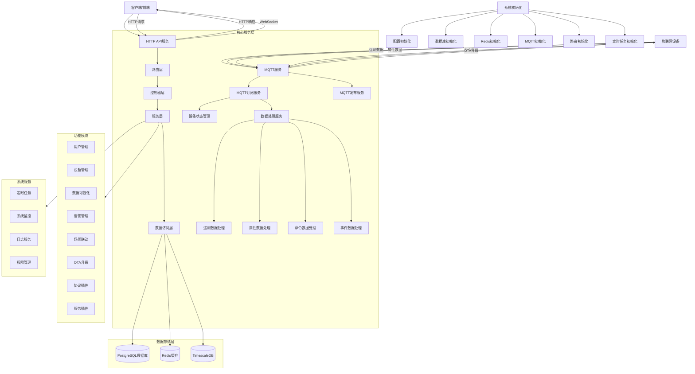

# ThingsPanel系统架构图

以下是基于代码分析的ThingsPanel系统架构图：

## 系统组件说明

### 核心组件

1. **HTTP API服务**：提供RESTful API接口，处理前端请求
2. **MQTT服务**：处理设备通信，包括数据上报和命令下发
3. **路由层**：管理API路由，将请求分发到对应的控制器
4. **控制器层**：处理业务逻辑，调用服务层
5. **服务层**：实现具体业务功能
6. **数据访问层**：提供数据库操作接口

### 数据存储

1. **PostgreSQL**：主数据库，存储系统配置、用户信息等
2. **Redis**：缓存服务，用于设备状态管理和数据缓存
3. **TimescaleDB**：时序数据库，用于存储设备遥测数据

### 功能模块

1. **用户管理**：用户注册、登录、权限管理
2. **设备管理**：设备注册、分组、配置管理
3. **数据可视化**：数据展示、仪表盘
4. **告警管理**：告警规则、通知
5. **场景联动**：自动化场景、条件触发
6. **OTA升级**：设备固件升级
7. **协议插件**：设备协议适配
8. **服务插件**：扩展服务功能

### 系统服务

1. **定时任务**：系统定时任务管理
2. **系统监控**：系统性能监控
3. **日志服务**：系统日志记录
4. **权限管理**：基于RBAC的权限控制

### 通信流程

1. **设备数据上报**：设备通过MQTT协议上报遥测数据、属性数据和事件数据
2. **命令下发**：系统通过MQTT协议向设备下发命令
3. **前端交互**：前端通过HTTP API与后端交互，获取数据和发送控制命令
4. **WebSocket**：用于实时数据推送和设备状态更新

## 系统特点

1. **模块化设计**：系统采用模块化设计，各功能模块相对独立
2. **可扩展性**：通过插件机制支持不同协议和服务的扩展
3. **高性能**：使用Redis缓存和TimescaleDB时序数据库提高系统性能
4. **实时性**：通过MQTT和WebSocket实现实时数据传输和状态更新
5. **安全性**：基于JWT的认证和RBAC的权限控制 